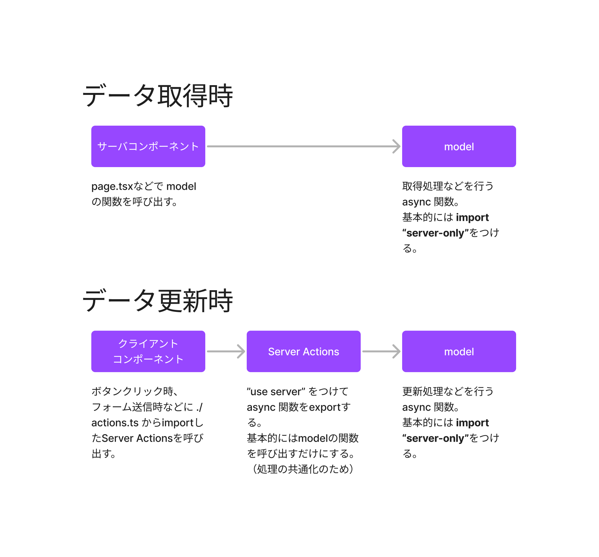

# みんしゅみ

## インストール方法

[こちらを参照](./doc/インストール.md)

## データ取得・更新に関するルール

- データの取得、更新などのサーバサイドロジック(model)を `/src/機能名/` ディレクトリ配下におき共通化する。 (サーバチームが担当)
- **データ取得**は基本的にサーバコンポーネントで行う。サーバコンポーネントから直接modelを呼ぶ。
- **データ更新時**はクライアントコンポーネントからサーバアクション経由でmodelを呼び出す。

詳しくは [データの取得と更新](./doc/データの取得と更新.md) を参照

## ユーティリティ

[こちらを参照](./src/util/README.md)

## スニペット(ショートカット)

[こちらを参照](./doc/スニペット.md)
